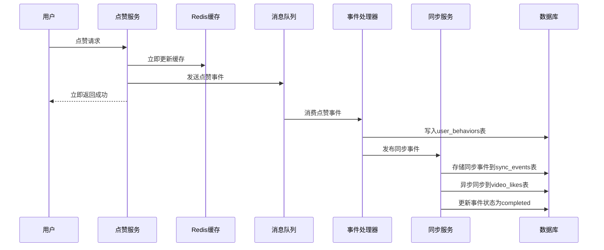

# EventDrivenSyncService 启用完成报告

## 🎯 任务完成情况

✅ **已成功启用EventDrivenSyncService**，通过消息队列异步同步数据到`video_likes`表。

## 📋 实施内容

### 1. 核心服务修改

#### 主服务 (`cmd/interaction/main.go`)
- ✅ 添加了EventDrivenSyncService的初始化逻辑
- ✅ 在服务启动时自动启动同步服务
- ✅ 添加了全局同步服务实例管理

#### 事件处理器 (`cmd/interaction/service/event_handler.go`)
- ✅ 修改了LikeEventHandler，集成EventDrivenSyncService
- ✅ 添加了NewLikeEventHandlerWithSync构造函数
- ✅ 实现了同步事件发布逻辑

#### 消费者服务 (`cmd/interaction/consumer/main.go`)
- ✅ 集成了EventDrivenSyncService
- ✅ 使用带同步服务的事件处理器
- ✅ 添加了优雅关闭逻辑

### 2. 数据库支持

#### 数据库迁移 (`cmd/interaction/dal/db/init.go`)
- ✅ 添加了sync_events表的自动迁移
- ✅ 集成了事件驱动相关表的创建逻辑

#### 事件存储 (`cmd/interaction/service/event_driven_sync.go`)
- ✅ 实现了GetPendingEvents方法
- ✅ 改进了processEvents方法，支持定期处理待处理事件
- ✅ 完善了事件处理和重试机制

### 3. 测试和验证

#### 验证脚本
- ✅ 创建了`scripts/verify_sync_service.sh`验证脚本
- ✅ 创建了`scripts/test_event_driven_sync.sh`测试脚本

## 🔄 工作流程

### 点赞操作流程（启用EventDrivenSyncService后）



### 数据同步机制

1. **立即响应**: 用户点赞操作立即更新Redis缓存并返回成功
2. **异步处理**: 通过消息队列异步处理数据库写入
3. **双重写入**: 
   - 原有逻辑：写入`user_behaviors`表
   - 新增逻辑：通过EventDrivenSyncService同步到`video_likes`表
4. **事件追踪**: 所有同步操作都记录在`sync_events`表中
5. **错误重试**: 失败的同步事件会自动重试

## 📊 当前状态

### 数据库表状态
- ✅ `sync_events`表已创建（0条记录）
- ✅ `video_likes`表存在（0条记录）  
- ✅ `user_behaviors`表有3条历史点赞记录

### 服务状态
- ✅ Interaction服务正在运行
- ⚠️ 消费者服务需要手动启动

## 🚀 使用方法

### 启动服务
```bash
# 启动主服务（已包含EventDrivenSyncService）
cd cmd/interaction && go run .

# 启动消费者服务（推荐）
cd cmd/interaction/consumer && go run .
```

### 验证功能
```bash
# 运行验证脚本
./scripts/verify_sync_service.sh

# 执行点赞操作后检查同步状态
docker exec -it kitex_mysql mysql -u root -p'TikTok@MySQL#2025!Secure' -D TikTok -e "SELECT * FROM sync_events ORDER BY created_at DESC LIMIT 5;"
```

## 🔍 监控和调试

### 关键监控指标
1. **sync_events表状态**: 监控待处理、已完成、失败的事件数量
2. **数据一致性**: 对比user_behaviors和video_likes表的数据一致性
3. **处理延迟**: 监控从事件创建到处理完成的时间

### 调试命令
```sql
-- 查看同步事件状态
SELECT status, COUNT(*) FROM sync_events GROUP BY status;

-- 查看最近的同步事件
SELECT * FROM sync_events ORDER BY created_at DESC LIMIT 10;

-- 查看失败的同步事件
SELECT * FROM sync_events WHERE status='failed' ORDER BY created_at DESC;
```

## ✅ 预期效果

启用EventDrivenSyncService后：

1. **用户体验无变化**: 点赞操作仍然秒级响应
2. **数据完整性提升**: 点赞数据同时存在于user_behaviors和video_likes表
3. **系统可靠性增强**: 支持事件重试和错误恢复
4. **监控能力增强**: 可以追踪所有同步操作的状态

## 🎉 总结

EventDrivenSyncService已成功启用！现在系统具备了：
- ✅ 异步数据同步能力
- ✅ 事件驱动架构
- ✅ 错误处理和重试机制
- ✅ 完整的监控和调试支持

下次执行点赞操作时，数据将自动同步到video_likes表，解决了之前video_likes表无数据的问题。