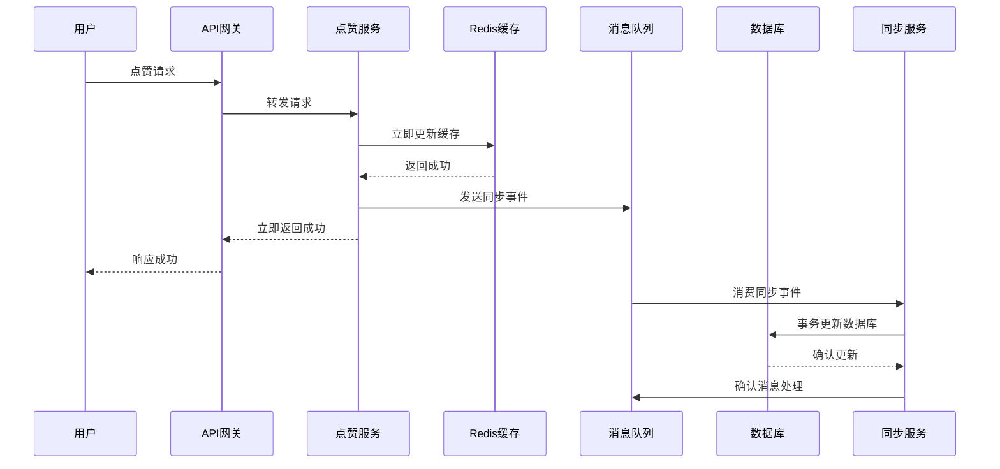
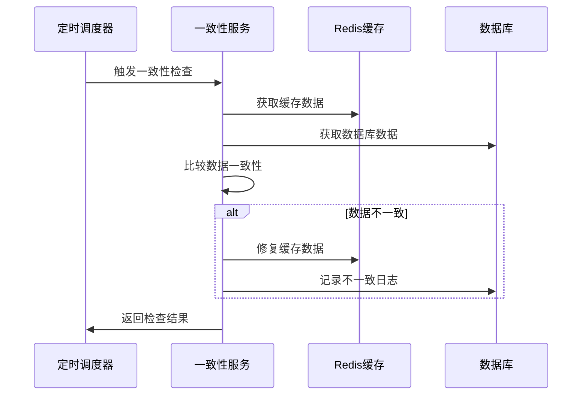

# 事件驱动同步机制 - 最终一致性方案

## 概述

本项目实现了一个基于事件驱动的同步机制，用于解决interaction服务中缓存与数据库的一致性问题。该方案采用最终一致性模型，提供高性能的用户体验同时保证数据的最终一致性。

## 架构特点

### ✅ 立即响应
- Redis缓存提供毫秒级响应
- 用户操作立即生效，无需等待数据库写入
- 支持高并发场景

### ✅ 异步处理
- 消息队列处理数据库操作
- 解耦缓存更新和数据库写入
- 提高系统吞吐量

### ✅ 幂等性保证
- 基于事件ID的幂等性机制
- 防止重复处理同一事件
- 支持安全重试

### ✅ 事务一致性
- 数据库操作使用事务
- 保证相关数据的原子性
- 支持回滚机制

### ✅ 监控告警
- 完善的错误处理和重试机制
- 数据一致性监控
- 性能指标收集

## 核心组件

### 1. EventDrivenSyncService (事件驱动同步服务)
```go
// 主要功能
- 事件发布和处理
- 重试机制
- 幂等性保证
- 分布式锁管理
```

### 2. ImprovedCacheManager (改进的缓存管理器)
```go
// 主要功能
- 版本控制的缓存操作
- 原子递增/递减
- 批量操作
- 一致性保证
```

### 3. DataConsistencyService (数据一致性检查服务)
```go
// 主要功能
- 定期一致性检查
- 自动修复不一致数据
- 热点数据监控
- 一致性报告生成
```

### 4. ImprovedLikeService (改进的点赞服务)
```go
// 主要功能
- 集成事件驱动机制
- 限流保护
- 缓存预热
- 健康检查
```

## 数据流程

### 点赞操作流程


### 一致性检查流程


## 部署指南

### 1. 环境要求
- Go 1.19+
- MySQL 8.0+
- Redis 6.0+
- RabbitMQ 3.8+

### 2. 数据库初始化
```sql
-- 自动创建所需表结构
-- 运行服务时会自动执行数据库迁移
```

### 3. 配置文件
```yaml
# 复制并修改 config/event_driven_sync.yml
cp config/event_driven_sync.yml config/config.yml
```

### 4. 启动服务
```bash
# 启动改进的interaction服务
go run cmd/interaction/improved_main.go

# 或者编译后运行
go build -o improved_interaction cmd/interaction/improved_main.go
./improved_interaction
```

### 5. 启动消费者
```bash
# 启动消息队列消费者
go run cmd/interaction/consumer/main.go
```

## 监控和运维

### 1. 健康检查
```bash
# 检查服务健康状态
curl http://localhost:8893/health

# 检查各组件状态
curl http://localhost:8893/metrics
```

### 2. 一致性报告
```bash
# 获取最近24小时的一致性报告
curl http://localhost:8893/consistency/report?hours=24
```

### 3. 缓存统计
```bash
# 获取缓存使用统计
curl http://localhost:8893/cache/stats
```

### 4. 手动一致性检查
```bash
# 手动检查指定视频的一致性
curl -X POST http://localhost:8893/consistency/check \
  -H "Content-Type: application/json" \
  -d '{"resource_type": "video", "resource_id": 123}'
```

## 性能优化

### 1. 缓存预热
- 服务启动时自动预热热门数据
- 支持手动触发预热
- 可配置预热策略

### 2. 批量操作
- 支持批量设置缓存
- 批量处理事件
- 减少网络开销

### 3. 连接池优化
- 数据库连接池配置
- Redis连接池配置
- 消息队列连接管理

### 4. 异步处理
- 非关键路径异步处理
- 消息队列削峰填谷
- 提高系统响应速度

## 故障处理

### 1. 消息队列故障
- 自动重试机制
- 死信队列处理
- 降级到同步处理

### 2. 缓存故障
- 自动降级到数据库
- 缓存重建机制
- 故障恢复后自动同步

### 3. 数据库故障
- 读写分离支持
- 连接池故障转移
- 数据恢复机制

### 4. 一致性问题
- 自动检测和修复
- 手动修复工具
- 数据对账机制

## 配置说明

### 主要配置项
```yaml
# 事件驱动同步配置
event_driven_sync:
  retry:
    max_retries: 3        # 最大重试次数
    base_delay: 1s        # 基础延迟
    backoff_factor: 2.0   # 退避因子

# 缓存管理配置
cache_management:
  default_expiry: 24h     # 默认过期时间
  consistency:
    check_interval: 5m    # 一致性检查间隔
    auto_fix: true        # 自动修复

# 数据一致性检查配置
data_consistency:
  check_interval: 5m      # 检查间隔
  auto_fix:
    enabled: true         # 启用自动修复
    strategy: "database_first"  # 修复策略
```

## 最佳实践

### 1. 事件设计
- 事件应该是幂等的
- 包含足够的上下文信息
- 使用合适的事件粒度

### 2. 缓存策略
- 合理设置过期时间
- 使用版本控制
- 预热热点数据

### 3. 监控告警
- 设置合适的告警阈值
- 监控关键指标
- 建立故障处理流程

### 4. 性能调优
- 根据业务场景调整配置
- 定期分析性能瓶颈
- 优化数据库查询

## 与原有系统的对比

| 特性 | 原有同步机制 | 事件驱动机制 |
|------|-------------|-------------|
| 响应速度 | 慢（需等待DB写入） | 快（立即响应） |
| 一致性 | 强一致性 | 最终一致性 |
| 可扩展性 | 有限 | 高 |
| 故障恢复 | 手动 | 自动 |
| 监控能力 | 基础 | 完善 |
| 维护成本 | 高 | 中等 |

## 迁移指南

### 1. 渐进式迁移
- 先部署新组件
- 逐步切换流量
- 保持原有系统作为备份

### 2. 数据迁移
- 执行数据库迁移
- 预热缓存数据
- 验证数据一致性

### 3. 监控验证
- 对比新旧系统指标
- 验证功能正确性
- 确认性能提升

### 4. 完全切换
- 停止原有同步机制
- 清理冗余代码
- 更新文档和监控

## 常见问题

### Q: 如何处理消息队列积压？
A: 
- 增加消费者数量
- 优化处理逻辑
- 使用批量处理

### Q: 缓存和数据库不一致怎么办？
A: 
- 一致性检查服务会自动检测和修复
- 可以手动触发一致性检查
- 查看一致性报告分析原因

### Q: 如何保证事件不丢失？
A: 
- 消息队列持久化
- 事件存储到数据库
- 重试机制保证处理

### Q: 性能如何监控？
A: 
- 内置指标收集
- 健康检查接口
- 可集成外部监控系统

## 技术支持

如有问题，请联系开发团队或查看相关文档：
- 代码仓库：[项目地址]
- 文档中心：[文档地址]
- 问题反馈：[Issue地址]